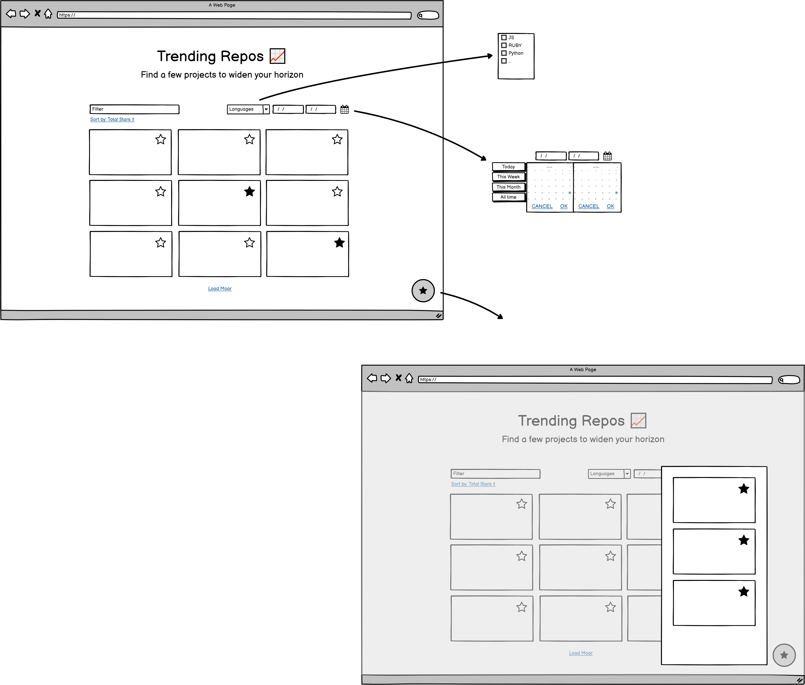

# Github Mini Client

This shall become a tiny, SPA GitHub Client, with a few basic functions and a focus on _discovering_ trending repos, filerable by Language.

This will use GitHubs public REST API, docs can be found here:  
https://docs.github.com/en/rest

The API does not provide a "trending" endpoint, I'll construct one myself, based on the amount of stars a repository has gotten in the specified time frame.

## Stuff I'd consider useful:
- Basic sorting, by name, language author and stars (total/in the timeframe)
- Customizing the timeframe
- A basic "Hide" function for each repo
- A darkmode/lightmode switch

## Tech I wanna use
- React & Typescript
- Tailwind for rapid layouting
- eslint
- axios

## Rough timeline
1. Rough plan and writing the readme (This is _NOW_ 😋)
2. NPM and Git
3. Getting first results / get to know the GitHub API
4. Wireframe
5. Components, tests and docs
6. Refinement and optional features (_'Stuff I'd consider useful'_)

## Wireframe
rough sketch of what I want the thing to look like:

## Afterthoughts & mini-retro
_good enough for v1, let's see, whats still to do_

What a nice little task! As is kind of usual, I took a lot more time, than originally planned. this is mostly due to three things:
1. There's always something to improve and expand upon (see below) and I just can't stop myself sometimes
2. My wireframing may have been a tiny bit too ambitious
3. I've never worked with Tailwind before. Now I have - it's amazing!

### Thinks to note for version 2:
- actually display the errormessage on axios reject
- make the filters into a form and bind the search method to the submit event
- more nice animations
- maybe a small tooltip for more author-informations
- ability to search for "no language" in the languages
- add predefined timeframes to search for
- save the state in localstorage
- export saved repos (maybe as JSON, idk)
- remove the few CRA leftovers (./public)
- add a 'sort-by'
- ...